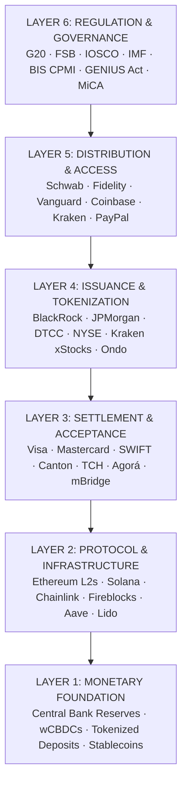

# Digital Finance Frontier

> **Architecture, Intelligence, and the Post-Quantum Future of Global Money**

A comprehensive research project mapping the full architecture of digital finance — from monetary foundations to AI agents, quantum threats, and geopolitical fragmentation.

---

## Overview

This project documents the most fundamental architectural transformation in global finance since double-entry bookkeeping. Three converging forces — **tokenization of real-world assets**, **AI-driven autonomous finance**, and **quantum-computing-driven cryptographic disruption** — are simultaneously rewriting the rules of money, settlement, compliance, and security.

## Key Findings

- Tokenized asset market: **$37B RWA** → projected **$16–30T by 2030–2034**
- Stablecoins: **$315B+** as de facto cross-border settlement layer
- **BIS Project Agorá** RVT completed July 2026 (28 institutions, 6 currencies, 80-second atomic settlement)
- **68% of new DeFi protocols** ship with AI agent integration
- **Post-quantum cryptography migration** is the most urgent cybersecurity issue in digital finance
- Geopolitical split: **G7 corridor** (Agorá/Pontes/SWIFT) vs. **China/Gulf corridor** (mBridge/e-CNY)

## Repository Structure
digital-finance-frontier/
├── 00-executive-summary/ # 5-page briefing + methodology
├── 01-architecture/ # Six-layer stack model
├── 02-global-institutions/ # BIS, FSB, IMF, G20, central banks
├── 03-platforms/ # Visa, Mastercard, Coinbase, Kraken, Fidelity, etc.
├── 04-tokenization/ # RWA market, DTCC, NYSE, projections
├── 05-defi-web3/ # DeFi TVL, stablecoins, L2s, BTCFi
├── 06-ai-finance/ # DeFAI, AI agents, AI forensics
├── 07-quantum-finance/ # PQC, quantum algorithms, bank programs
├── 08-cybersecurity-intelligence/ # DFINT framework, OSINT, AML
├── 09-geopolitics/ # G7 vs China/Gulf, bridge jurisdictions
├── 10-disruptive-technologies/ # ZK proofs, HE, programmable money
├── 11-research-labs/ # Universities, industry R&D, papers
├── 12-timeline-projections/ # 2026→2035 scenarios
├── 13-forensics-intelligence/ # DFINT methodology, case studies
├── 14-strategic-analysis/ # Value capture, risk, career pathway
├── 15-appendices/ # Glossary, data sources, bibliography
├── code/ # Python scripts, ML models, quantum sims
├── data/ # Market data, on-chain analytics
└── assets/ # Diagrams, charts, infographics


## The Six-Layer Architecture


## Quick Start

```bash
# Clone
git clone https://github.com/YOUR_USERNAME/digital-finance-frontier.git
cd digital-finance-frontier

# View the executive summary
cat 00-executive-summary/executive-summary.md

# Run forensics tools
cd code/forensics
python3 chain_analysis.py --chain ethereum --address 0x...

# Run quantum simulation
cd code/quantum-sim
python3 portfolio_qaoa.py --assets 50 --constraints 10   

Data Sources
Source	Type
RWA.xyz	Tokenized asset data
DeFiLlama	DeFi TVL
BIS	Central bank research
FSB	Regulatory reports
IMF	Working papers
NIST PQC	Post-quantum standards
Dune Analytics	On-chain analytics
Nansen	Wallet analytics

License
CC BY-NC 4.0 — Free to use, share, and adapt for non-commercial purposes with attribution.

Contributing
See CONTRIBUTING.md.

Built with research from 100+ sources across institutional reports, academic papers, on-chain data, and industry disclosures.

---

## `LICENSE`
Creative Commons Attribution-NonCommercial 4.0 International (CC BY-NC 4.0)

Copyright (c) 2026 [gaiagiannah]

You are free to:
Share — copy and redistribute the material in any medium or format
Adapt — remix, transform, and build upon the material

Under the following terms:
Attribution — You must give appropriate credit, provide a link to the license, and indicate if changes were made.
NonCommercial — You may not use the material for commercial purposes.

---

## `CONTRIBUTING.md`

```markdown
# Contributing

## How to Contribute

1. Fork the repository
2. Create a feature branch (`git checkout -b feature/amazing-feature`)
3. Commit your changes (`git commit -m 'Add amazing feature'`)
4. Push to the branch (`git push origin feature/amazing-feature`)
5. Open a Pull Request

## Style Guide

- Use Markdown for all documentation
- Cite all sources (APA 7th edition for academic, institutional format for reports)
- Include data timestamps for on-chain/market data
- Use tables for comparable data
- Use code blocks for technical specifications

## Adding New Content

- New chapters: Add to the appropriate numbered directory
- New data: Add to `data/` with source and timestamp
- New code: Add to `code/` with a README explaining usage
- New references: Add to `15-appendices/references.md`   
